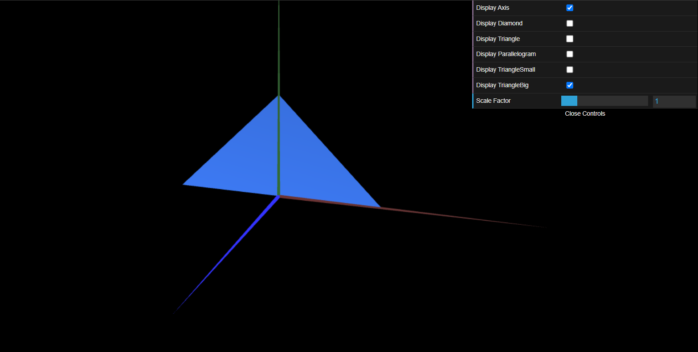

# CG 2023/2024

## Group T05G07

## TP 1 Notes

- In exercise 1.1 we created the following buffers:

```javascript
    this.vertices = [
        -1, 1, 0,    //0
        -1, -1, 0,    //1
        1, -1, 0,    //2
    ];

    //Counter-clockwise reference of vertices
    this.indices = [
        0, 1, 2,
    ];
```
We noticed that, if we changed the order of the indices to `0,2,1`, the triangle will be visible on the other side.

Additionally, in the exercise 1.4, since the face is drawn on the counter-clockwise side, to ensure visibility on both sides, we simply needed to add the reverse order of the indices for each triangle.


