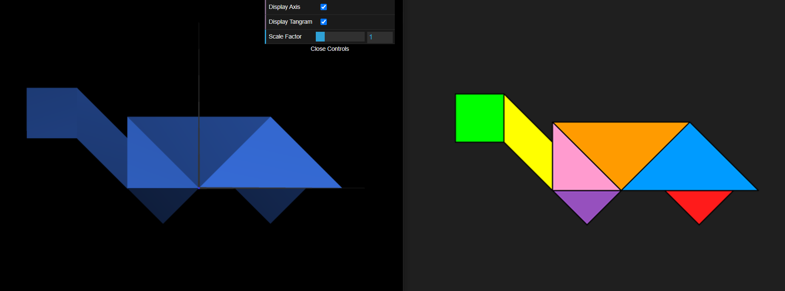
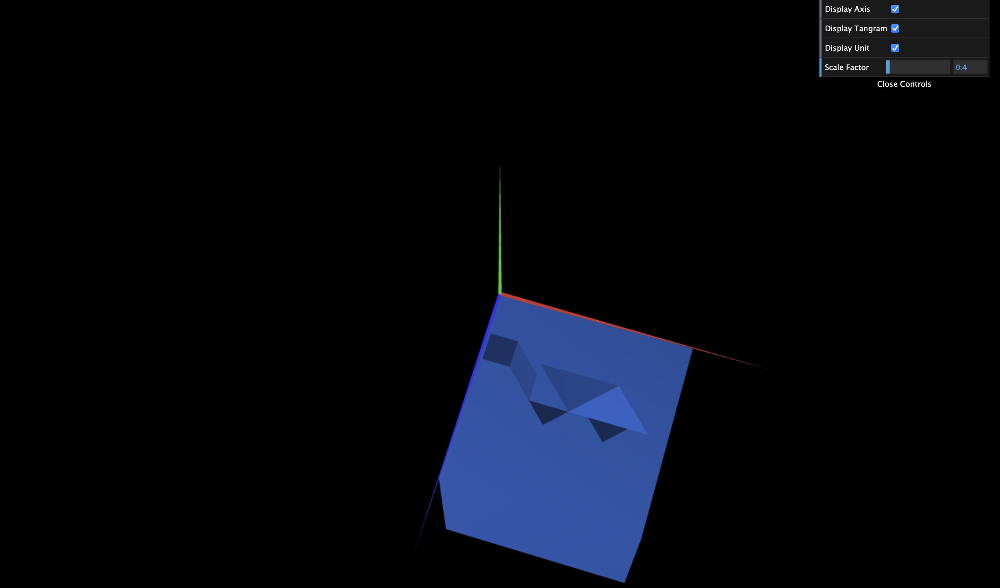
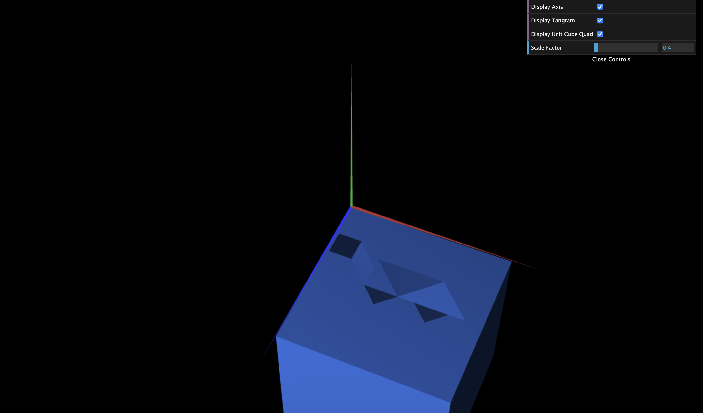

# CG 2023/2024

## Group T05G07

## TP 2 Notes

- No exercício 1, tivemos dificuldades em acertar o tamanho do paralelogramo para desenhar o `Tangram`. Nós queríamos que ele ficasse mais esticado para diminuir a largura, mas ao fazer isso também diminuíamos o tamanho do lado que fica junto ao quadrado, e, desse modo, já não ficava do mesmo tamanho do lado do quadrado. Acabamos por chegar à conclusão que estávamos a olhar para o paralelogramo de forma errada, então decidimos aplicar-lhe uma rotação de 45º e ficou logo bem.



- No exercício 2, notamos que quando desenhavamos primeiro o `Tangram`, eram aplicadas ao `UnitCube` transformações indesejadas

Após uma rápida vista de olhos à função `display()` do `MyTangram`, notamos imediatamente o problema:

```js
scene.pushMatrix();
scene.translate(-0.5, 0, 0);
scene.scale(0.5, 0.5, 1);
scene.rotate((180 * Math.PI) / 180, 0, 0, 1);
this.triangleSmall.display();
scene.translate(-3, 0, 0);
this.triangleSmall.display();
```

Esta foi a última adição ao `Tangram`. Como é possível notar, depois destas transformações serem aplicadas, não é chamada a função `scene.popMatrix()`. Devido a isso, estavam a ser aplicadas ao `UnitCube` diversas transformações não desejadas. Após chamar a função `scene.popMatrix()`, o cubo voltou à origem e com os tamanhos **unitários**, tal como queríamos.



- O exercício 3 foi bastante straight-forward, sem algum problema.

