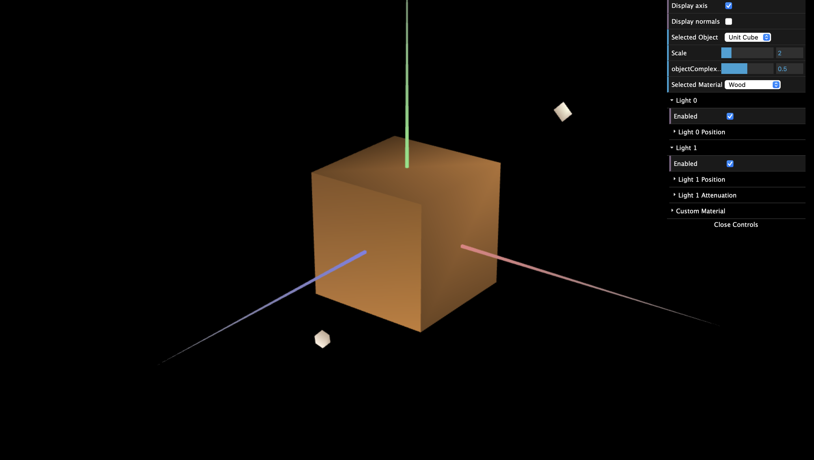
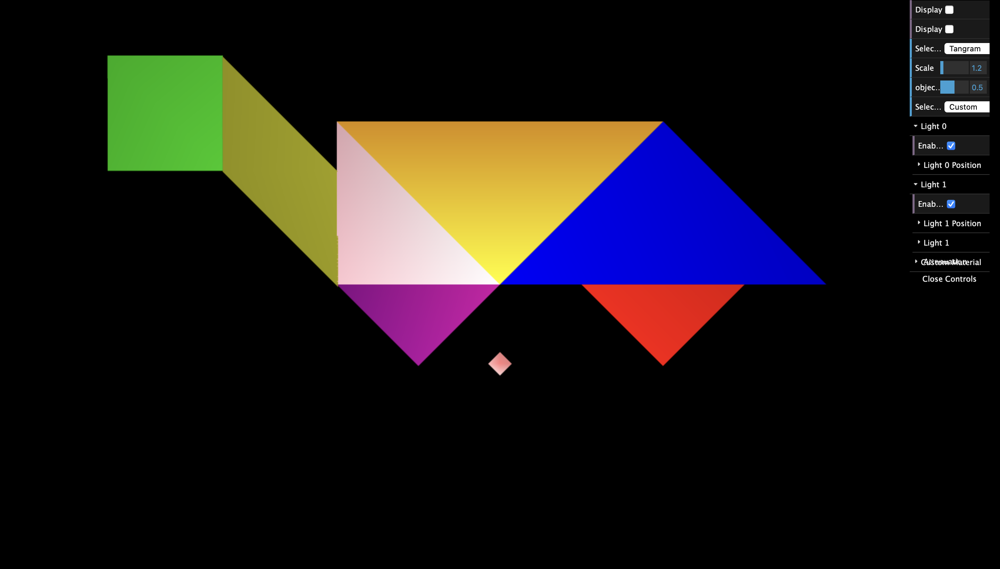
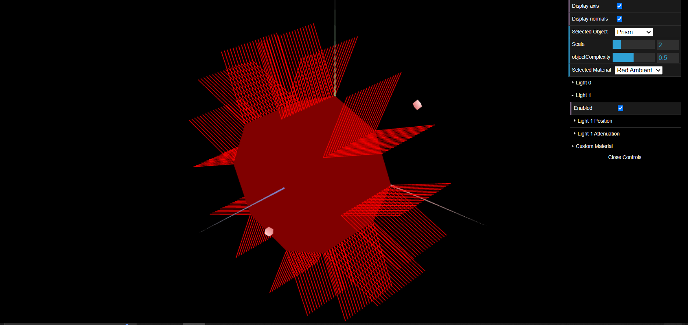
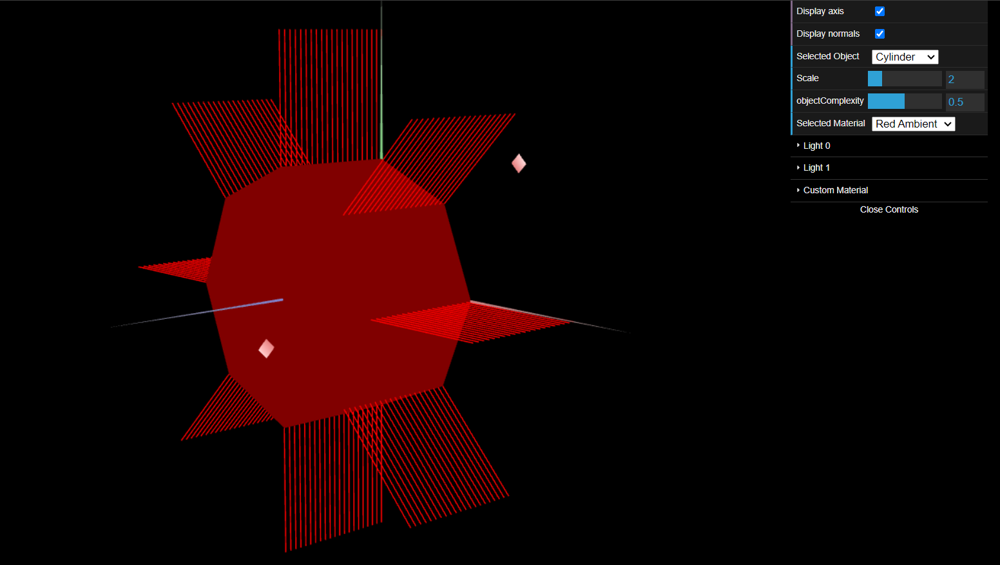

# CG 2023/2024

## Group T05G07

## TP 3 Notes

- No exercício 1 não tivemos muitos problemas, foi só uma tarefa relativamente trabalhosa porque tivemos que atualizar os vértices e índices das figuras anteriores, nomeadamente o `UnitCube` foi o mais trabalhoso, pois tem muitos vértices.

- Tivemos algumas dificuldades no exercício 2 devido ao cálculo das normais

- O exercício 3 foi mais simples que o anterior. Depois de ter feito o exercício 2, este acabou por ser mais fácil.

