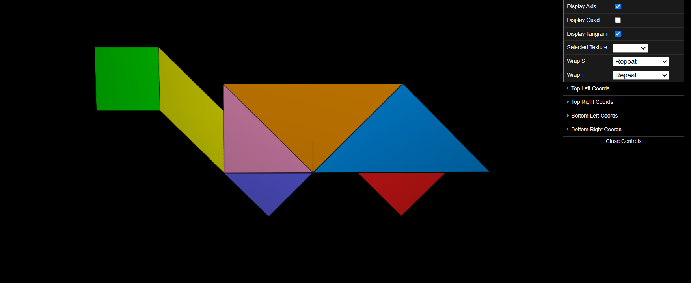

# CG 2023/2024

## Group T05G07

## TP 4 Notes

- O exercício 1 foi bastante simples, essencialmente foi só ligar os vértices dos prismas aos pontos corretos da imagem.

- O exercício 2 foi, também, bastante simples, na nossa opinião.

