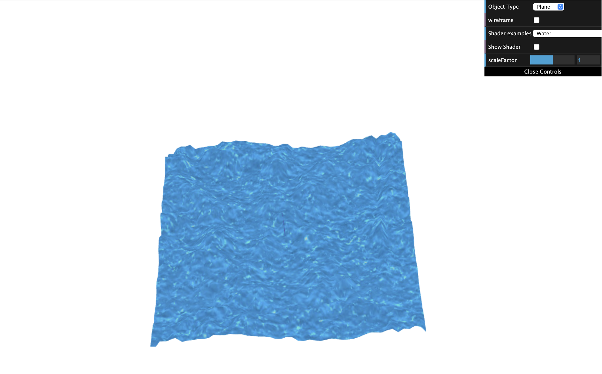

# CG 2023/2024

## Group T05G07

## TP 5 Notes

- No exercício 1, tivemos algumas dificuldades para perceber o que escrever nos ficheiros do shaders. No entanto, com a ajuda do professor, rapidamente conseguimos entender.

- Este exercício foi bastante simples

- No exercício 2, tivemos algumas dificuldades em perceber como criar o efeito de animação, mas depois acabamos por utilizar o `texture3anim` como exemplo e conseguimos chegar lá.

